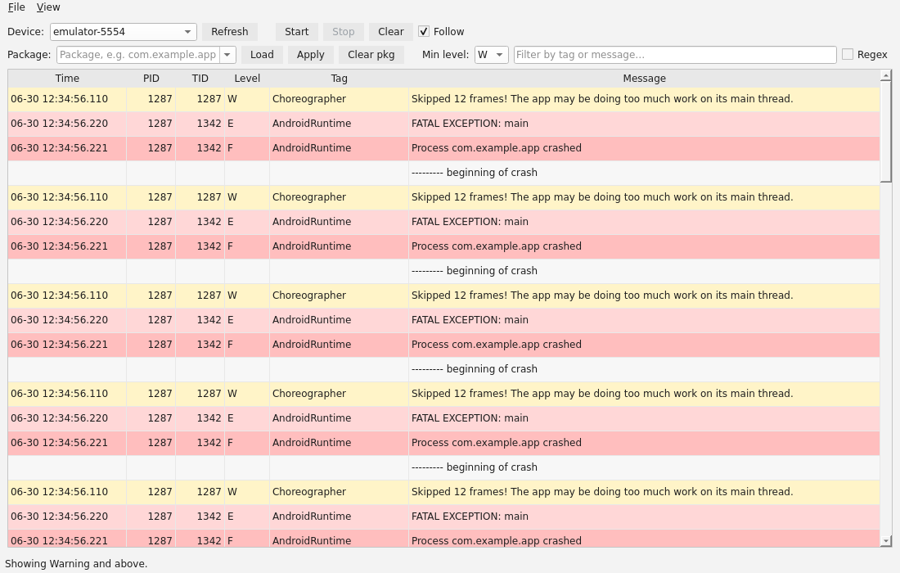
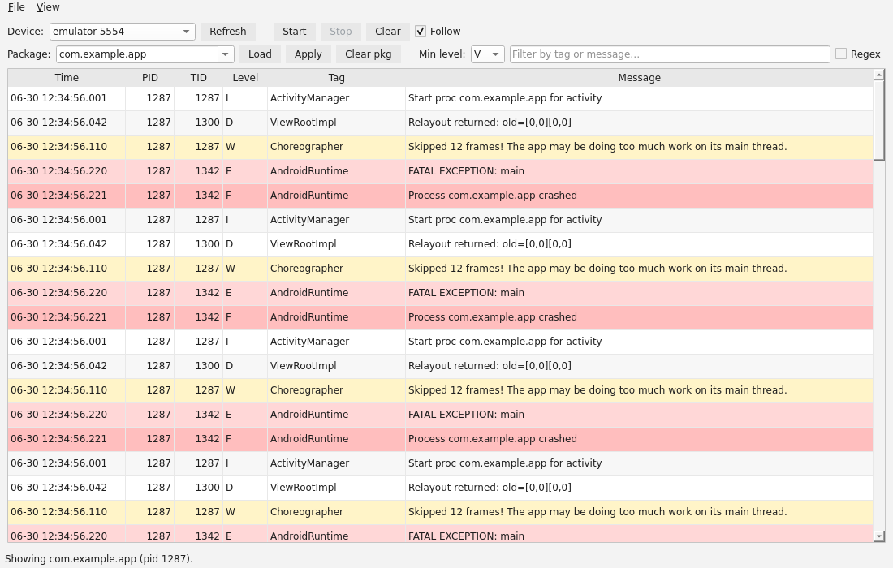
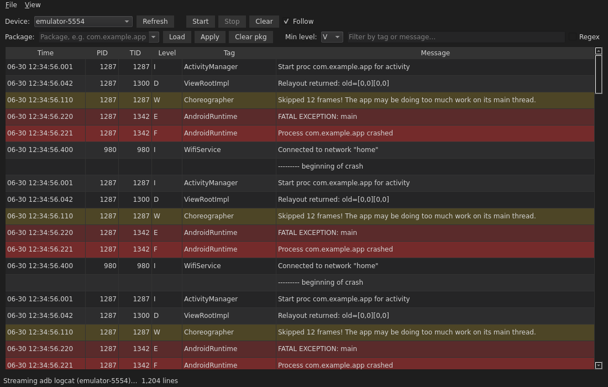

# zLog User Guide

zLog is a desktop viewer for Android `adb logcat`. It streams your device's logs
into a fast, filterable table so you can find what matters — and save it to read
later. This guide walks through everyday use.

## Before you start

1. Install [Android platform-tools](https://developer.android.com/tools/releases/platform-tools)
   and make sure `adb` is on your PATH (run `adb version` to check).
2. Connect a device with **USB debugging** enabled, or start an emulator.
3. Launch zLog:

   ```bash
   uv run zlog
   ```

## Streaming logs

Pick your device from the **Device** dropdown (press **Refresh** if it isn't
listed yet), then click **Start**. Logs stream in live, newest at the bottom.


- **Follow** (on by default) keeps the view pinned to the newest line. Turn it off
  to scroll back through history without being pulled to the bottom.
- **Clear** empties the view; **Stop** ends streaming.
- Warnings are tinted amber, errors and fatals red, so problems jump out.

## Filtering

zLog has three filters that combine — a line must pass all of them to show.

**By level.** Use **Min level** to hide anything below a severity. Set it to `W`
to see only warnings and above:



**By app (package).** Type or pick a package and click **Apply** to show only that
app's process. zLog resolves the package to its PID(s) on the device; if the app
restarts, zLog follows the new process automatically. **Load** fills the dropdown
with the device's installed apps; **Clear pkg** removes the filter.



**By text or regex.** Type in the search box to match the tag or message. Tick
**Regex** to use a regular expression (e.g. `Exception|ANR`); an invalid pattern
tints the box and keeps your previous filter.

## Dark mode

Switch between **Light** and **Dark** from **View → Theme**. Dark is easy on the
eyes for long sessions:



## Saving and reopening logs

- **File → Save Log…** (Ctrl+S) writes everything captured to a `.log` file in the
  standard `logcat` text format — readable in any editor.
- **File → Open Log…** (Ctrl+O) loads a saved file so you can read it offline, with
  no device attached. Opening a file stops any live stream first.

## Tips

- Columns are draggable — widen **Message** or **Tag** to taste.
- The status bar shows the current line count and what just happened (device found,
  filter applied, file saved).
- No device connected? The empty view tells you what to do next.

## Troubleshooting

- **"adb not found"** — install platform-tools and add `adb` to your PATH.
- **No devices listed** — check the USB cable/authorization dialog on the phone,
  then press **Refresh**. `adb devices` in a terminal should show it too.
