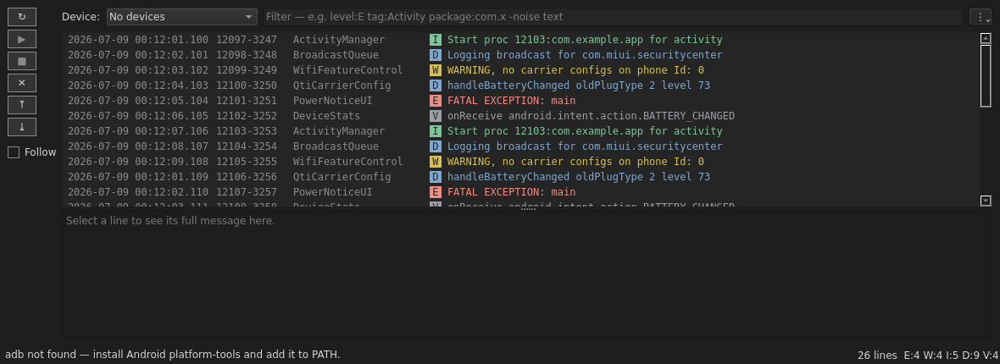

# zLog User Guide

zLog is a desktop viewer for Android `adb logcat`. It streams your device's logs
into a fast, dense, one-line-per-entry view — with a single query bar to filter
down to what matters — and can save a capture to read later. This guide walks
through everyday use.

## Before you start

1. Install [Android platform-tools](https://developer.android.com/tools/releases/platform-tools)
   and make sure `adb` is on your PATH (run `adb version` to check).
2. Connect a device with **USB debugging** enabled, or start an emulator.
3. Launch zLog:

   ```bash
   uv run zlog
   ```

## The window at a glance

- A **device bar** holds the **Device** dropdown and the stream controls:
  refresh, start, stop, clear, a **Follow** toggle, and jump-to-oldest / newest.
  A **Package** selector sits on the same bar: **Load** fills it with the
  process/package names seen in the current log (no device needed), and picking
  one filters the view (a `proc:` token) — the selection and the query stay in sync.
- Below it, a **filter bar** holds the **query bar** on its own full-width row,
  with a **Level** dropdown for the minimum severity.
- The menu bar has **File**, **View**, and **Settings…**. File handles open/save,
  sessions, and export; View holds commands and navigation (clear filters, problems,
  bookmarks, zoom, presets, tag summary); **Settings…** opens the preferences dialog.
- A **Saved Filters** sidebar (left) lists your saved query presets for one-click use.
- Each device you stream from opens in its own **tab** (Ctrl+T for a new tab), and
  **File → New Window** (Ctrl+Shift+N) opens a second, independent window.
- The **log view** shows one line per entry — `time  pid-tid  tag  level  message`
  — with each level in its own color (I green, D blue, W amber, E/F red).



## Streaming logs

Pick your device from **Device** (press refresh if it isn't listed yet), then click
**Start**. Logs stream in live, newest at the bottom.

- **Follow** (on by default) keeps the view pinned to the newest line. Turn it off
  to scroll back through history without being pulled to the bottom; the jump buttons
  go to the oldest / newest line at any time.
- **Clear** empties the view; **Stop** ends streaming.

## Filtering with the query bar

Type in the **query bar** to narrow the view. Terms combine — a line must match all
of them. Bare words match the tag or message; prefixes target a field:

| Type this | To… |
|---|---|
| `timeout` | show lines whose tag or message contains "timeout" |
| `level:E` | show only Error and above (V D I W E F) |
| `tag:Activity` | show only lines whose tag contains "Activity" |
| `proc:com.example` | show only lines whose resolved process/package name contains this |
| `package:com.example` | alias of `proc:` (filters by the log's process name — no device needed) |
| `pid:1234` | show only lines from that exact PID (comma-set: `pid:100,200`) |
| `-GnssHal` | **hide** lines matching this term (repeatable, e.g. `-Gnss -Sensors`) |
| `/Skipped \d+ frames/` | match a **regular expression** |
| `"two words"` | quote to include spaces |

Example — errors from one tag, hiding noise:

```
level:E tag:Activity -Gnss
```


The **Level** dropdown and the query's `level:` token stay in sync — pick a level and
it appears in the query; type `level:W` and the dropdown follows.

**Right-click a line → Filter to…** to add its **Level**, **Tag**, **PID**, or
**Package** to the query without typing. Right-click also offers muting a tag and
highlighting a tag with a color.

An invalid regex tints the query bar and keeps your previous filter. The status bar
shows how many lines are visible (e.g. *Showing 8 of 26 lines*) plus a per-level
tally. Press **Clear Filters** (in the **View** menu) or empty the query to show everything.

Filtering by tag or any field works the same way:


## Settings

**Settings…** (menu bar, after View) opens a tabbed preferences dialog. Changes apply
on **OK** and are remembered across launches:

- **Appearance** — theme (Light/Dark), font size offset, show/hide the detail pane.
- **Log view** — time display (absolute / since start / delta), highlight-instead-of-hide,
  case-sensitive search, collapse repeated lines, **show process names**, and **wrap
  long messages**.
- **Capture** — which `adb logcat` buffers to read (main/system/crash/radio/events/kernel),
  start-from (whole buffer or the last N lines), the ring-buffer **limit** (any number of
  lines, or unlimited), and clear-the-view-on-start.
- **Behavior** — follow the tail, reopen the last log on launch, autosave capture to disk.

## Process / package names

Turn on **Settings → Log view → Show process names** to add a column with each line's
app/package, resolved from the device (an `adb shell ps` snapshot plus the `Start proc`
lines in the log) — like Android Studio's logcat. Because PIDs are recycled, a rare old
line may show a blank or stale name.

## Highlight instead of hide

Prefer to keep every line visible and just *highlight* the matches? Turn on
**Settings → Log view → Highlight matches instead of hiding non-matches**. Use
**F3 / Shift+F3** to jump between matches.

## Wrap long messages

By default each entry is a single dense line, with long messages elided. Turn on
**Settings → Log view → Wrap long messages** to grow each row to show its *full*
message across as many lines as needed. It's optional because sizing every row to its
content is heavier on very large captures — turn it off (or cap the buffer) for maximum
speed. The detail pane always shows the complete text of the selected line regardless.

## Themes

Switch between **Light** and **Dark** in **Settings → Appearance → Theme**.


## Reading, bookmarking, and zoom

- Select a line to see its full, word-wrapped text in the detail pane. Selecting text
  there and pressing **Ctrl+C** copies just that selection.
- **Ctrl+B** bookmarks the selected line (a colored marker appears);
  **Ctrl+F2 / Ctrl+Shift+F2** jump between bookmarks (**View** menu).
- **Ctrl+= / Ctrl+- / Ctrl+0** zoom the text in, out, and back to default
  (Ctrl+mouse-wheel works too).
- **Time display** (**Settings → Log view**) switches the timestamp between absolute,
  elapsed since the first line, and delta from the previous line.
- **Ctrl+K** opens a **command palette** to run any menu action by name.

## Saving and reopening logs

From the **File** menu:

- **Save Log…** (Ctrl+S) writes everything captured to a `.log` file in the standard
  `logcat` text format — readable in any editor. **Save Filtered Log…** writes only
  the lines currently visible. **Export** writes CSV / JSON / HTML.
- **Open Log…** (Ctrl+O) loads a saved file to read offline, with no device attached.
  Opening a file stops any live stream first.
- **Save Session… / Open Session…** keep the log together with its filters, tag
  highlights, and bookmarks so you can pick up exactly where you left off.

## Filter presets

Save a query you use often via **View → Filter Presets → Save current filter as…**,
or the **Save current filter…** button on the **Saved Filters** sidebar. From the
sidebar you can double-click a preset to apply it, preview its contents, **Rename** it,
**Update to current** (overwrite it with the current filter), or **Delete** it. Presets
persist across launches.

## Capturing a dumpsys snapshot

**File → Capture dumpsys…** saves a one-shot `adb shell dumpsys` to a text file —
leave the service blank for everything, or name one (e.g. `battery`, `meminfo`,
`activity`) to grab just that. Handy to keep next to a log for context.

## Command line (headless tail)

Run zLog from a terminal without the GUI to stream filtered logcat to stdout:

```
zlog --tail --filter "level:E -Choreographer" --serial <device>
```

`--filter` takes the same query language as the filter bar (level/tag/pid/search/
`-exclude`/`/regex/`); `--adb` sets an explicit adb path, `--buffers main,system`
picks buffers, and `--dump N` starts from the last N lines. (`proc:` and
`since:`/`until:` are GUI-only.)

## Troubleshooting

- **"adb not found"** — install platform-tools and add `adb` to your PATH.
- **No devices listed** — check the USB cable/authorization dialog on the phone,
  then press refresh. `adb devices` in a terminal should show it too.
- **Something went wrong / reporting a bug** — zLog keeps its own diagnostics log
  (`zlog.log`, rotated) next to its settings. Open **Help → Open Log Folder** to
  find it; it records startup info, the `adb` command used, and any errors with
  tracebacks. For more detail, set the `ZLOG_LOG_LEVEL=DEBUG` environment variable
  before launching.
