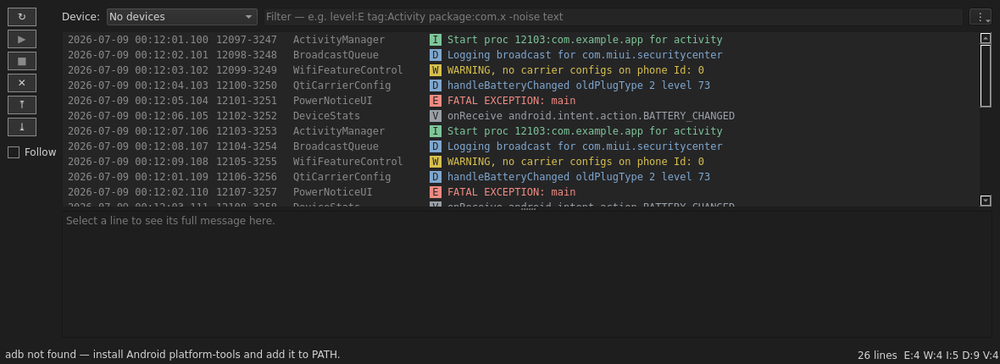

# zLog User Guide

zLog is a desktop viewer for Android `adb logcat`. It streams your device's logs
into a fast, dense, one-line-per-entry view — with a single query bar to filter
down to what matters — and can save a capture to read later. This guide walks
through everyday use.

## Before you start

1. Install [Android platform-tools](https://developer.android.com/tools/releases/platform-tools)
   and make sure `adb` is on your PATH (run `adb version` to check).
2. Connect a device with **USB debugging** enabled, or start an emulator.
3. Launch zLog:

   ```bash
   uv run zlog
   ```

## The window at a glance

- A **device bar** holds the **Device** dropdown and the stream controls:
  refresh, start, stop, clear, a **Follow** toggle, and jump-to-oldest / newest.
  An **App** selector sits on the same bar: **Load** fills it with the
  process/package names seen in the current log *and*, on Windows, the ones
  currently running on this PC (a name in both is marked **●**); pick one and
  **Apply** filters the view (a `proc:` token) — the selection and the query
  stay in sync. **Launch App…** starts a program and captures it from its very
  first line (see "Launching the app from zLog" below).
- Below it, a **filter bar** holds the **query bar** on its own full-width row,
  with a **Level** dropdown for the minimum severity.
- The menu bar has **File**, **View**, and **Settings…**. File handles open/save,
  sessions, and export; View holds commands and navigation (clear filters, problems,
  bookmarks, zoom, presets, tag summary); **Settings…** opens the preferences dialog.
- A **Saved Filters** sidebar (left) lists your saved query presets for one-click use.
- **View → Restore Tabs on Launch** brings back the tabs you had open — each file
  reopened with its query and app filter. A file that's since moved is skipped
  quietly. Live captures aren't resumed: a streaming tab returns as an empty tab
  with its filter intact, so nothing starts recording behind your back.
- Each tab shows its **state and size** at a glance: **●** streaming, **⏸** paused,
  **⚠** disconnected (waiting to reconnect), plus a line count like `(1.2k)`. Hover
  for the full name and exact count. Drag tabs to reorder them; closing one that's
  still capturing asks first.
- Work in **tabs**: the **+** button on the tab bar (or Ctrl+T) starts a fresh tab
  so you can record another device without losing what's already there. **Open Log…**
  and **Open Recent** open the file in a new tab too (reusing the current tab only
  when it's still empty and idle), labeled by the file name — so an existing recording
  or log stays intact. Close a tab with its ×. For fully separate windows, use
  **File → New Window** (Ctrl+Shift+N).
- The **log view** shows one line per entry — `time  pid-tid  tag  level  message`
  — with each level in its own color (I green, D blue, W amber, E/F red).



## Streaming logs

Pick your device from **Device** (press refresh if it isn't listed yet), then click
**Start**. Logs stream in live, newest at the bottom.

- **Follow** (on by default) keeps the view pinned to the newest line. Turn it off
  to scroll back through history without being pulled to the bottom; the jump buttons
  go to the oldest / newest line at any time.
- **Clear** empties the view; **Stop** ends streaming.

## Following a log file (tail -f)

Many apps neither print to a console nor emit debug output — they write their own
log file. **File → Follow File…** points zLog at one: it loads what's there, then
streams each new line as it's written, into its own tab named after the file.
Everything else works as usual (query bar, levels, presets, export), and **Stop**
ends it.

It copes with the file being rotated: if your logger truncates it or replaces it
with a fresh one, zLog notices and re-reads from the start rather than going
quiet. A line that's still being written is held back until it's complete, so you
never see half a line. This works on any platform.

## Debugging a Windows app (OutputDebugString)

Capturing your PC works exactly like capturing a phone: pick **This PC (debug
output)** in the **Device** dropdown and press **Start**. It sits below any
connected devices — so a phone you plug in is always at the top — and it's the
only entry when nothing is attached. (**File → Capture Debug Output (This PC)**
does the same thing if you prefer the menu.)

That streams the Windows debug channel — the `OutputDebugString` output that most
Windows apps and frameworks (C/C++, .NET `Debug`/`Trace`, Qt, and others) emit.
It opens in a tab labeled **● Debug Output**, and every line is tagged with the
emitting process, so you focus on the app you're debugging with the usual query
bar — `proc:myapp.exe` or `pid:1234`. **Stop** ends the capture.

While **This PC** is selected, the device-only controls (Clear device, Wi-Fi,
Capture dumpsys) grey out, since there's no device to talk to.

This is the same mechanism Sysinternals DebugView uses, so a few things follow
from it: only one capturer can run at a time (close DebugView or a debugger first),
an app already attached to a debugger sends its output there instead, and
capturing Windows **services** needs to run zLog as administrator. It's a
Windows-only feature; on other platforms the action reports that and does nothing.

### Focusing on one app

The **App** selector on the device bar is your control for this. **Load** lists
names seen in the current log plus (on Windows) everything currently running, so
**Apply** narrows the view to whichever you pick — a `proc:<name>` token that
combines with everything else (`level:E`, excludes, presets). If a name hasn't
logged anything yet, it still shows up once it's running — Load again to pick it
up. For one exact process among several sharing a name, right-click an existing
line from it and use **Filter to… → PID** instead.

### Launching the app from zLog

**Launch App…** (on the App row, or **File → Launch App…**) starts a program and
captures it from its very first line — something you can't get by attaching to
an app that's already running. Choose the program (plus optional arguments and
working directory) and zLog opens a tab named after it, capturing **both** its
console output (stdout/stderr) *and*, on
Windows, its `OutputDebugString` tracing, then focuses the view on it. **Stop**
ends the capture and closes the app. A GUI app usually prints nothing to the
console — that's normal, its debug output still arrives.

### Streaming the Windows Event Log

**File → Capture Event Log…** streams a Windows Event Log channel — crashes,
service failures, and OS/driver events, including for apps that never call
`OutputDebugString`. Pick a channel (Application, System, Setup, Security, or
type any other channel name) and it opens a tab, backfilling the last 200
existing events before streaming new ones live. Provider name maps to `tag`,
process/thread id to `pid`/`tid`, and severity to level (Critical/Error →
`F`/`E`, Warning → `W`, Information/Verbose → `I`/`V`) — so `level:`, `tag:`,
`pid:`, and Tag Summary all work exactly as they do for logcat. **Security**
normally needs an elevated (administrator) zLog. **Stop** ends the capture.
Windows-only; the action reports that and does nothing elsewhere.

## Filtering with the query bar

Type in the **query bar** to narrow the view. Terms combine — a line must match all
of them. Bare words match the tag or message; prefixes target a field:

| Type this | To… |
|---|---|
| `timeout` | show lines whose tag or message contains "timeout" |
| `level:E` | show only Error and above (V D I W E F) |
| `tag:Activity` | show only lines whose tag contains "Activity" |
| `proc:com.example` | show only lines whose resolved process/package name contains this |
| `package:com.example` | alias of `proc:` (filters by the log's process name — no device needed) |
| `pid:1234` | show only lines from that exact PID (comma-set: `pid:100,200`) |
| `-GnssHal` | **hide** lines matching this term (repeatable, e.g. `-Gnss -Sensors`) |
| `/Skipped \d+ frames/` | match a **regular expression** |
| `"two words"` | quote to include spaces |

Example — errors from one tag, hiding noise:

```
level:E tag:Activity -Gnss
```


As you type, an **autocomplete** popup suggests field keys (`level:`, `tag:`, `pid:`,
`proc:`, …) when you start a token, level names (with "Filter by ERROR or higher"
hints) after `level:`, and the tags / PIDs / process names seen in the current log
after `tag:` / `pid:` / `proc:`. Press **Enter** or **Tab** to insert the highlighted
suggestion (it replaces just the token you're typing).

The **Level** dropdown and the query's `level:` token stay in sync — pick a level and
it appears in the query; type `level:W` and the dropdown follows.

**Right-click a line → Filter to…** to add its **Level**, **Tag**, **PID**, or
**App** to the query without typing. Right-click also offers muting a tag and
highlighting a tag with a color.

An invalid regex tints the query bar and keeps your previous filter. The status bar
shows how many lines are visible (e.g. *Showing 8 of 26 lines*) plus a per-level
tally. Press **Clear Filters** (in the **View** menu) or empty the query to show everything.

Filtering by tag or any field works the same way:


## Settings

**Settings…** (menu bar, after View) opens a tabbed preferences dialog. Changes apply
on **OK** and are remembered across launches:

- **Appearance** — theme (Light/Dark), font size offset, show/hide the detail pane.
- **Log view** — time display (absolute / since start / delta), highlight-instead-of-hide,
  case-sensitive search, collapse repeated lines, **show process names**, and **wrap
  long messages**.
- **Capture** — which `adb logcat` buffers to read (main/system/crash/radio/events/kernel),
  start-from (whole buffer or the last N lines), the ring-buffer **limit** (any number of
  lines, or unlimited), and clear-the-view-on-start.
- **Behavior** — follow the tail, reopen the last log on launch, autosave capture to disk.

## Process / package names

Turn on **Settings → Log view → Show process names** to add a column with each line's
app/package, resolved from the device (an `adb shell ps` snapshot plus the `Start proc`
lines in the log) — like Android Studio's logcat. Because PIDs are recycled, a rare old
line may show a blank or stale name.

## Highlight instead of hide

Prefer to keep every line visible and just *highlight* the matches? Turn on
**Settings → Log view → Highlight matches instead of hiding non-matches**. Use
**F3 / Shift+F3** to jump between matches.

## Wrap long messages

By default each entry is a single dense line, with long messages elided. Turn on
**Settings → Log view → Wrap long messages** to grow each row to show its *full*
message across as many lines as needed. It's optional because sizing every row to its
content is heavier on very large captures — turn it off (or cap the buffer) for maximum
speed. The detail pane always shows the complete text of the selected line regardless.

## Themes

Switch between **Light**, **Dark**, **Solarized Dark**, and **Monokai** in
**Settings → Appearance → Theme**.


Click **Edit theme…** next to the picker to open the theme editor: swatches for
every color (grouped into General / Level backgrounds / Level text) with a hex
field beside each one. Edits repaint the log immediately so you can see the
result before committing to it; **Revert** undoes everything back to the theme
you opened the editor with, and **Cancel** discards the whole live preview.
**Save** asks for a name (rejecting one that collides with a built-in theme)
and adds it to the theme picker, persisted across launches like the built-ins.

## Reading, bookmarking, and zoom

- Select a line to see its full, word-wrapped text in the detail pane. Selecting text
  there and pressing **Ctrl+C** copies just that selection.
- **Ctrl+B** bookmarks the selected line (a colored marker appears);
  **Ctrl+F2 / Ctrl+Shift+F2** jump between bookmarks (**View** menu).
- **Ctrl+= / Ctrl+- / Ctrl+0** zoom the text in, out, and back to default
  (Ctrl+mouse-wheel works too).
- **Time display** (**Settings → Log view**) switches the timestamp between absolute,
  elapsed since the first line, and delta from the previous line.
- **Ctrl+K** opens a **command palette** to run any menu action by name.

## Saving and reopening logs

From the **File** menu:

- **Save Log…** (Ctrl+S) writes everything captured to a `.log` file in the standard
  `logcat` text format — readable in any editor. **Save Filtered Log…** writes only
  the lines currently visible. **Export** writes CSV / JSON / HTML / PDF — all four
  export what's currently visible (filtered), masked by **Redact secrets** if that's
  on. PDF is landscape A4 with level colors, a header (title/query/line count), and
  page numbers; captures over 50,000 lines are capped with a prompt to narrow the
  filter or export just the first 50,000.
- **Open Log…** (Ctrl+O) loads a saved file to read offline, with no device attached.
  Opening a file stops any live stream first.
- **Save Session… / Open Session…** keep the log together with its filters, tag
  highlights, and bookmarks so you can pick up exactly where you left off.

## Filter presets

The **Save/Update** button on the filter row (left of **Clear filters**) adapts to
context: with an unsaved filter it reads **Save filter…** and creates a new preset;
once you've applied a saved filter it reads **Update ‹name›** and overwrites that
preset with your current (edited) query — so you can tweak a loaded filter and save
the change back. It returns to **Save** when you **Clear filters** or empty the query
bar. You can also save from **View → Filter Presets → Save current filter as…**.

The **Saved Filters** sidebar lists your presets: double-click one to apply it, or
**right-click** for **Apply / Clone… / Edit… / Rename… / Delete** (right-click empty
space for **Add…**). *Add…* opens a Name + Query editor pre-filled with your current
filter; *Clone…* duplicates the clicked preset (seeded with its query and a "‹name›
copy" name); *Edit…* changes a preset's query (use *Rename…* to change just its name).
Presets persist across launches.

## Merged multi-device view

**File → Merge All Devices** streams every connected device into one interleaved
view, tagging each line with its device. Lines are ordered by arrival (devices
aren't clock-synced). Filter to one device with `device:<serial>` (or hide one with
`-device:<serial>`); the selected line's device shows in the detail pane. **Stop**
ends all the device streams at once.

## Capturing a dumpsys snapshot

**File → Capture dumpsys…** saves a one-shot `adb shell dumpsys` to a text file —
leave the service blank for everything, or name one (e.g. `battery`, `meminfo`,
`activity`) to grab just that. Handy to keep next to a log for context.

## Watching for a pattern

**View → Set Watch…** notifies you when a captured line contains a substring —
handy while a build runs in the background. It matches `tag + message`
regardless of the current filter, and throttles to at most one notification
every 3 seconds. It shows a system-tray toast if one is available, otherwise a
status-bar message plus a beep.

Optionally, set a **Run command** too: on a hit, zLog runs it (throttled to at
most once every 10 seconds) with placeholders substituted from the matching
line — `{message}` `{tag}` `{pid}` `{level}` `{time}` `{line}` (the whole
line). The command is parsed into its own argv **before** any log data is
inserted and always run **without a shell**, so a matched line containing `;`,
`&&`, or quotes can't inject anything — it just becomes literal text inside one
argument. zLog asks you to confirm the first time you set a new command, since
it runs an arbitrary program on your machine. Example: `myscript.exe {tag}
{message}` to log a hit, or a notifier that pops up a bigger alert than the
built-in toast.

## Command line (headless tail)

Run zLog from a terminal without the GUI to stream filtered logcat to stdout:

```
zlog --tail --filter "level:E -Choreographer" --serial <device>
```

`--filter` takes the same query language as the filter bar (level/tag/pid/search/
`-exclude`/`/regex/`); `--adb` sets an explicit adb path, `--buffers main,system`
picks buffers, and `--dump N` starts from the last N lines. (`proc:` and
`since:`/`until:` are GUI-only.)

## Troubleshooting

- **"adb not found"** — install platform-tools and add `adb` to your PATH.
- **No devices listed** — check the USB cable/authorization dialog on the phone,
  then press refresh. `adb devices` in a terminal should show it too.
- **Something went wrong / reporting a bug** — zLog keeps its own diagnostics log
  (`zlog.log`, rotated) next to its settings. Open **Help → Open Log Folder** to
  find it; it records startup info, the `adb` command used, and any errors with
  tracebacks. For more detail, set the `ZLOG_LOG_LEVEL=DEBUG` environment variable
  before launching.
